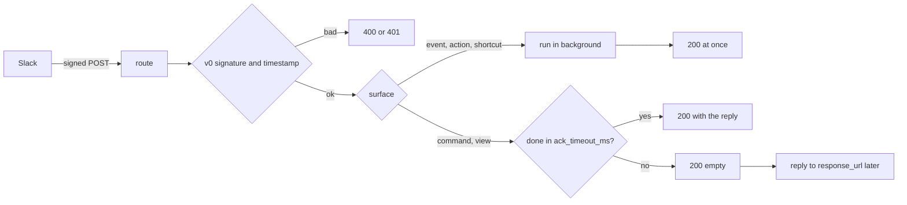

# autumn-plugin-slack

Slack plugin for [autumn-web](https://autumn-web.app) 0.8.

- Verified Slack routes: Events API, slash commands, and interactivity.
- Typed handlers by event type, command, `action_id`, or `callback_id`.
- A Web API client with safe retry rules, and `response_url` replies.
- Health indicator, Prometheus metrics, and drain on shutdown.
- Test helpers: request signing and a fake transport.

## Install

```toml
[dependencies]
autumn-plugin-slack = "0.1"
```

```rust,ignore
use autumn_plugin_slack::payload::{CommandResponse, EventCallback, Message, MessageEvent, SlashCommand};
use autumn_plugin_slack::{HandlerResult, SlackContext, SlackPlugin};

async fn on_mention(ctx: SlackContext, ev: EventCallback) -> HandlerResult<()> {
    let msg: MessageEvent = ev.parse()?;
    if let (Some(channel), Some(ts)) = (msg.channel, msg.ts) {
        ctx.client()
            .chat_post_message(&channel, &Message::text("Hi!").in_thread(ts))
            .await?;
    }
    Ok(())
}

async fn deploy(_ctx: SlackContext, cmd: SlashCommand) -> HandlerResult<CommandResponse> {
    Ok(CommandResponse::ephemeral(format!("Deploying {}", cmd.text)))
}

#[autumn_web::main]
async fn main() {
    autumn_web::app()
        .plugin(
            SlackPlugin::new()
                .on_event("app_mention", on_mention)
                .command("/deploy", deploy),
        )
        .run()
        .await;
}
```

Set two env vars: `SLACK_SIGNING_SECRET` and `SLACK_BOT_TOKEN`.
See `examples/app.rs` for buttons, modals, and the Home tab.

## Slack app setup

Set these URLs in the Slack app config. `/slack` is the default base path.

| Slack setting | URL |
|---|---|
| Event Subscriptions | `https://<host>/slack/events` |
| Slash Commands | `https://<host>/slack/commands` |
| Interactivity & Shortcuts | `https://<host>/slack/interactions` |

Change the base path with `SlackPlugin::new().base_path("/hooks/slack")`.
It is a builder setting: autumn mounts routes before it loads config.

### CSRF and bot protection

Slack sends no CSRF token and no CAPTCHA token. The Slack signature protects
the routes. If CSRF or bot protection is on, exempt the base path:

```toml
[security.csrf]
exempt_paths = ["/slack"]

[security]
captcha_exempt_paths = ["/slack"]
```

The plugin cannot add these exemptions. If they are missing, the app stops at
startup and the error gives this fix.

## Handlers

| Builder call | Key | Handler returns | Ack |
|---|---|---|---|
| `on_event` | event type, for example `app_mention` | `()` | At once. The handler runs after. |
| `command` | command name, for example `/deploy` | `CommandResponse` | Waits up to `ack_timeout_ms`. |
| `action` | block `action_id` | `Option<Message>` | At once. A message goes to `response_url`. |
| `view_submission` | view `callback_id` | `ViewResponse` | Waits up to `ack_timeout_ms`. |
| `view_closed` | view `callback_id` | `()` | At once. |
| `shortcut` | `callback_id` (global or message) | `()` | At once. |

A handler is `async fn(SlackContext, Payload) -> HandlerResult<T>`.
`SlackContext` gives the Web API client and the app state.
Any error type converts with `?`.



### Slow commands

Slack wants a reply in 3 s. When a command handler takes longer than
`ack_timeout_ms` (default 2500), the plugin sends an empty 200. The handler
continues. Its reply then goes to the `response_url`. For a view submission,
a late reply is lost and the modal closes.

### Errors

A handler error or panic does not stop the app. A command gets
`error_text` as an ephemeral reply. Other surfaces log the error. Slack never
sees error details.

### Delivery

Slack delivers events at least once. The plugin drops a repeat `event_id`
inside `dedup_window_secs` (default 1 h). The default store is in memory, per
process. For many replicas, use a shared store. autumn's Redis store needs
the autumn-web `redis` feature:

```rust,ignore
SlackPlugin::new().with_replay_store(Arc::new(RedisWebhookReplayStore::from_config(&cfg)?))
```

Handlers run in the background and are not durable. Enqueue a `#[job]` for
work that must survive a restart.

## Web API client

```rust,ignore
let c = ctx.client();
c.chat_post_message("C123", &Message::text("Hello").blocks(blocks)).await?;
c.views_open(&trigger_id, &modal).await?;
let users = c.paginate("users.list", &json!({"limit": 200}), "members", 10).await?;
let any = c.call("pins.add", &json!({"channel": "C123", "timestamp": ts})).await?;
```

Outside a handler: `SlackClient::from_state(&state)`.

| Call | Retry on 429 | Retry on 5xx and network errors |
|---|---|---|
| Write: `call`, `chat_*`, `views_*`, `reactions_add` | Yes | No. A retry can post twice. |
| Read: `call_read`, `users_info`, `auth_test`, `paginate` | Yes | Yes, with backoff |

A 429 waits for `Retry-After`. A wait longer than `api.max_wait_ms` stops the
call with `SlackError::RateLimited`. `ok: false` gives `SlackError::Api` with
the Slack code. `respond` posts to a `response_url` only on an allowed host
(default `hooks.slack.com`), and sends no token.

## Config

`[slack]` in `autumn.toml`. Profile files and `AUTUMN_SLACK__*` env vars
override it. A list env value is comma-separated.

| Key | Default | Meaning |
|---|---|---|
| `signing_secret_env` | `SLACK_SIGNING_SECRET` | Env var with the signing secret. Required. |
| `previous_signing_secret_envs` | `[]` | Env vars with old secrets, for rotation. |
| `bot_token_env` | `SLACK_BOT_TOKEN` | Env var with the bot token. |
| `api_base_url` | `https://slack.com/api/` | Web API base URL. |
| `timestamp_tolerance_secs` | `300` | Largest clock distance, 1 to 3600. |
| `ack_timeout_ms` | `2500` | Wait for command and view handlers, 1 to 2900. |
| `max_body_bytes` | `1048576` | Largest request body. |
| `dedup_window_secs` | `3600` | Time to remember an event ID. |
| `drain_timeout_secs` | `10` | Wait for handlers at shutdown. |
| `error_text` | `Sorry, that did not work. Try again later.` | Reply when a command fails. |
| `unknown_command_text` | `This command is not available.` | Reply for a command with no handler. |
| `response_url_hosts` | `["hooks.slack.com"]` | Allowed `response_url` hosts. |
| `api.max_attempts` | `3` | Attempts per call, 1 to 10. |
| `api.initial_backoff_ms` | `500` | First backoff for read retries. |
| `api.max_wait_ms` | `30000` | Largest wait before a retry. |
| `api.timeout_ms` | `10000` | Time limit per HTTP attempt. |
| `health.cache_secs` | `30` | Time to keep an `auth.test` result. |

Builder overrides: `with_signing_secret`, `with_previous_signing_secret`,
`with_bot_token`, `with_config`, `with_transport`, `with_clock`,
`with_replay_store`, `readiness`.

## Operations

- **Health:** `slack` on `/actuator/health`. It calls `auth.test` and keeps
  the result for `health.cache_secs`. `readiness(true)` also puts it in
  `/ready`. Details give a short error code only.
- **Metrics** on `/actuator/prometheus`:
  `slack_requests_total{surface,outcome}`,
  `slack_handler_runs_total{surface,outcome}`,
  `slack_api_calls_total{method,outcome}`,
  `slack_api_retries_total{method}`, `slack_handlers_in_flight`.
  Label values never come from Slack data.
- **Shutdown:** the plugin waits for in-flight handlers up to
  `drain_timeout_secs`.
- **Logs:** no tokens, no secrets, no bodies.

## Test your app

```rust,ignore
use autumn_plugin_slack::{testing, transport::{HttpReply, MemoryTransport}};

let t = MemoryTransport::new();
t.respond("chat.postMessage", HttpReply::json(200, &json!({"ok": true, "channel": "C1", "ts": "1.0"})));
let client = TestApp::new()
    .plugin(my_plugin().with_signing_secret("s").with_bot_token("xoxb-t").with_transport(t.clone()))
    .build();
let ts = /* now, Unix seconds */;
let [(h1, v1), (h2, v2)] = testing::signed_headers("s", ts, body.as_bytes());
client.post("/slack/events").header(h1, &v1).header(h2, &v2).body(body).send().await;
assert_eq!(t.requests_to("chat.postMessage").len(), 1);
```

## Not in scope

OAuth v2 install for many workspaces, Socket Mode, file uploads, typed
Block Kit builders, options load (`block_suggestion`), Workflow steps.
autumn `[alerts] slack_webhook_url` already sends alerts to Slack.

## Development

See `CLAUDE.md`. Design: `docs/plan.md`, `docs/adr/`.

## License

Apache-2.0.
