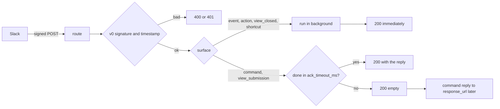

# autumn-plugin-slack

Slack plugin for [autumn-web](https://autumn-web.app) 0.8.

- Signature-checked Slack routes: Events API, slash commands, and interactivity.
- Typed handlers by event type, command, `action_id`, or `callback_id`.
- A Web API client with safe retry rules, and `response_url` replies.
- Health indicator, Prometheus metrics, and drain on shutdown.
- Test helpers: request signing and a fake transport.

## Install

```toml
[dependencies]
autumn-plugin-slack = "0.1"
```

```rust,ignore
use autumn_plugin_slack::payload::{CommandResponse, EventCallback, Message, MessageEvent, SlashCommand};
use autumn_plugin_slack::{HandlerResult, SlackContext, SlackPlugin};

async fn on_mention(ctx: SlackContext, ev: EventCallback) -> HandlerResult<()> {
    let msg: MessageEvent = ev.parse()?;
    // Reply in the thread. A reply in a thread uses the parent `ts`.
    if let (Some(channel), Some(ts)) = (msg.channel, msg.thread_ts.or(msg.ts)) {
        ctx.client()
            .chat_post_message(&channel, &Message::text("Hi!").in_thread(ts))
            .await?;
    }
    Ok(())
}

async fn deploy(_ctx: SlackContext, cmd: SlashCommand) -> HandlerResult<CommandResponse> {
    Ok(CommandResponse::ephemeral(format!("Deploying {}", cmd.text)))
}

#[autumn_web::main]
async fn main() {
    autumn_web::app()
        .plugin(
            SlackPlugin::new()
                .on_event("app_mention", on_mention)
                .command("/deploy", deploy),
        )
        .run()
        .await;
}
```

Set two env vars: `SLACK_SIGNING_SECRET` and `SLACK_BOT_TOKEN`.
See `examples/app.rs` for buttons, modals, and the Home tab.

## Slack app setup

Set these URLs in the Slack app config. `/slack` is the default base path.

| Slack setting | URL |
|---|---|
| Event Subscriptions | `https://<host>/slack/events` |
| Slash Commands | `https://<host>/slack/commands` |
| Interactivity & Shortcuts | `https://<host>/slack/interactions` |

To change the base path, use `SlackPlugin::new().base_path("/hooks/slack")`.
This is a builder setting, because autumn mounts routes before it loads config.

### CSRF and bot protection

Slack sends no CSRF token and no CAPTCHA token. The Slack signature protects
the routes. If CSRF or bot protection is on, exempt the base path:

```toml
[security.csrf]
exempt_paths = ["/slack"]

[security]
captcha_exempt_paths = ["/slack"]
```

The plugin cannot add these exemptions. If an exemption is missing, the app
stops at startup. The error message shows the fix.

### Process roles

The routes serve only in the `web` and combined roles. A `worker` process
needs no signing secret and no exemption. It still gets the Web API client.

## Handlers

An **ack** is the HTTP reply to Slack. Slack must get the ack in 3 s.

| Builder call | Key | Handler returns | Ack |
|---|---|---|---|
| `on_event` | event type, for example `app_mention` | `()` | Immediately. The ack does not wait for the handler. |
| `command` | command name, for example `/deploy` | `CommandResponse` | Waits up to `ack_timeout_ms` for the reply. |
| `action` | block `action_id` | `Option<Message>` | Immediately. A message goes to `response_url`. |
| `view_submission` | view `callback_id` | `ViewResponse` | Waits up to `ack_timeout_ms` for the reply. |
| `view_closed` | view `callback_id` | `()` | Immediately. |
| `shortcut` | `callback_id` (global or message) | `()` | Immediately. |

A handler is `async fn(SlackContext, Payload) -> HandlerResult<T>`.
`SlackContext` gives the Web API client and the app state.
You can use `?` with any error type.



### Slow commands

If a command handler takes more than `ack_timeout_ms` (default 2500), the
plugin sends an empty 200. The handler continues. Then its reply goes to the
`response_url`. Slack does not get a late view reply. The modal closes.

### Errors

A handler error or panic does not stop the app. For a command, the user gets
`error_text` as an ephemeral reply. For other surfaces, the plugin logs the
error. Slack never gets error details.

### Delivery

Slack delivers events at least once. The plugin drops a repeat `event_id`
in `dedup_window_secs` (default 1 h). Slack's retry count and reason are in
`EventCallback::retry_num` and `retry_reason`.

The default dedup store is in memory, for one process. For many replicas,
use a shared store. autumn's Redis store needs the autumn-web `redis`
feature:

```rust,ignore
use autumn_web::webhook::{RedisWebhookReplayStore, WebhookReplayRedisConfig};

let redis: WebhookReplayRedisConfig = /* from your config */;
SlackPlugin::new().with_replay_store(Arc::new(RedisWebhookReplayStore::from_config(&redis)?))
```

A restart stops background handlers. Use a `#[job]` for work that must
continue after a restart.

### Not in scope

`block_suggestion` (options load) gets `{"options": []}`, so the menu shows
no options and no error.

## Web API client

```rust,ignore
let c = ctx.client();
c.chat_post_message("C123", &Message::text("Hello").blocks(blocks)).await?;
c.views_open(&trigger_id, &modal).await?;
let users = c.paginate("users.list", &json!({"limit": 200}), "members", 10).await?;
let any = c.call("pins.add", &json!({"channel": "C123", "timestamp": ts})).await?;
```

Outside a handler, `SlackClient::from_state(&state)` gives
`Option<SlackClient>`. The plugin starts before job workers, so a `#[job]`
can use it.

| Call | Retry after 429 | Retry after 5xx or network error |
|---|---|---|
| Write: `call`, `chat_*`, `views_*`, `reactions_add` | Yes | No. A retry can post twice. |
| Read: `call_read`, `users_info`, `auth_test`, `paginate` | Yes | Yes, with backoff |

- After a 429, the client waits for the `Retry-After` time (1 s if there is
  no header). If the wait is more than `api.max_wait_ms`, or no attempts
  remain, the call stops with `SlackError::RateLimited`.
- `views_open` and `views_push` retry one time only, and wait 1 s or less
  before the retry, because a `trigger_id` is valid for 3 s only.
- `ok: false` gives `SlackError::Api` with the Slack code.
- `respond` posts to a `response_url` only on an allowed host (default
  `hooks.slack.com`) over HTTPS. It sends no token.

## Config

`[slack]` in `autumn.toml`. A profile file (for example `autumn-prod.toml`)
and `AUTUMN_SLACK__*` env vars override it. In an env var, put a comma
between list items. The plugin does not read `[profile.<name>.slack]`. With
`strict_config`, autumn stops at startup when it finds that section.

| Key | Default | Meaning |
|---|---|---|
| `signing_secret_env` | `SLACK_SIGNING_SECRET` | Env var with the signing secret. Required in `web` processes. |
| `previous_signing_secret_envs` | `[]` | Env vars with old secrets, for rotation. |
| `bot_token_env` | `SLACK_BOT_TOKEN` | Env var with the bot token. |
| `api_base_url` | `https://slack.com/api/` | Web API base URL. `http` only on a loopback host. |
| `timestamp_tolerance_secs` | `300` | Maximum difference between the request time and the server time, 1 to 3600 s. |
| `ack_timeout_ms` | `2500` | Wait for command and view handlers, 1 to 2700 ms. |
| `max_body_bytes` | `1048576` | Maximum request body. |
| `dedup_window_secs` | `3600` | Time to keep an event ID. |
| `drain_timeout_secs` | `10` | Wait for handlers at shutdown. |
| `error_text` | `Sorry, that did not work. Try again later.` | Reply when a command fails. |
| `unknown_command_text` | `This command is not available.` | Reply for a command with no handler. |
| `response_url_hosts` | `["hooks.slack.com"]` | Allowed `response_url` hosts. |
| `api.max_attempts` | `3` | Attempts for each call, 1 to 10. |
| `api.initial_backoff_ms` | `500` | First backoff for read retries. |
| `api.max_wait_ms` | `30000` | Maximum wait before a retry. |
| `api.timeout_ms` | `10000` | Time limit for each HTTP attempt. |
| `health.cache_secs` | `30` | Time to keep an `Up` result. A `Down` result stays 5 s or less. |

The plugin ignores an empty signing secret. A secret must come from an env
var or from a builder call.

Constructors: `SlackPlugin::new()` (reads `[slack]`) and
`SlackPlugin::with_config(config)`. Builder calls: `base_path`, `readiness`,
`with_signing_secret`, `with_previous_signing_secret`, `with_bot_token`,
`with_transport`, `with_transport_arc`, `with_clock`, `with_replay_store`.

## Operations

- **Health:** `slack` on `/actuator/health`. Each check makes one
  `auth.test` attempt. It does not retry. It keeps `Up` for
  `health.cache_secs` and `Down` for 5 s or less. One check runs at a time.
  Other probes get the result of that check. `readiness(true)` also puts it in `/ready`. Details give a
  short error code only.
- **Metrics** on `/actuator/prometheus`:
  - `slack_requests_total{surface,outcome}`
  - `slack_handler_runs_total{surface,outcome}` (each run counts once)
  - `slack_late_acks_total{surface}` (handlers that did not end before the ack)
  - `slack_api_calls_total{method,outcome}`
  - `slack_api_retries_total{method}`
  - `slack_handlers_in_flight`

  A label value is a fixed word or a method name from your code. It never
  comes from Slack data.
- **Shutdown:** the routes reply 503, so Slack retries events later. The
  plugin waits for running handlers up to `drain_timeout_secs`. autumn
  gives all shutdown hooks `[server] shutdown_timeout_secs` in total, so
  the wait can be shorter.
- **Logs:** no tokens, no secrets, no bodies.

## Test your app

```rust,ignore
use autumn_plugin_slack::testing;
use autumn_plugin_slack::transport::{HttpReply, MemoryTransport};
use autumn_web::test::TestApp;
use serde_json::json;

let t = MemoryTransport::new();
t.respond(
    "chat.postMessage",
    HttpReply::json(200, &json!({"ok": true, "channel": "C1", "ts": "1.0"})),
);
let plugin = SlackPlugin::new()
    .on_event("app_mention", on_mention)
    .with_signing_secret("s")
    .with_bot_token("xoxb-t")
    .with_transport(t.clone());
let client = TestApp::new().plugin(plugin).build();

let body = json!({"type": "event_callback", "event_id": "E1",
    "event": {"type": "app_mention", "channel": "C1", "ts": "1.0"}}).to_string();
let now = /* the time now, in Unix seconds */;
let [(h1, v1), (h2, v2)] = testing::signed_headers("s", now, body.as_bytes());
client.post("/slack/events").header(h1, &v1).header(h2, &v2).body(body).send().await;
// The handler runs after the ack. Wait for its call, then check it.
assert_eq!(t.requests_to("chat.postMessage").len(), 1);
```

Use `MemoryTransport::set_latency` to make replies slow. Use it to test the
ack window and the health time limit.

## Not in scope

OAuth v2 install for many workspaces, Socket Mode, file uploads, typed
Block Kit builders, options load (`block_suggestion`), Workflow steps, and a
limit on concurrent handlers. autumn `[alerts] slack_webhook_url` already
sends alerts to Slack.

## Development

See `CLAUDE.md`. Design: `docs/plan.md`, `docs/adr/`. Evidence for each
acceptance criterion: `docs/ac-evidence.md`.

## License

Apache-2.0.
