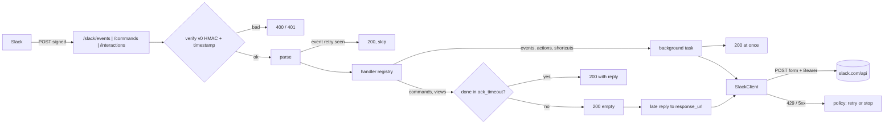

# Plan: `autumn-plugin-slack`

Style: ASD-STE100. Short sentences. Active voice.

## 1. Problem

Teams build Slack apps next to their web apps.
A Slack app gets signed HTTP requests from Slack and calls the Slack Web API.
autumn-web 0.8 can verify Slack Events API requests (`SignedWebhook`).
It cannot verify slash commands or interactions. They have no delivery ID.
It has no Slack Web API client. It has no handler routing for Slack.
This plugin adds these with no upstream change.

No GitHub issue exists for this work. Section 8 gives the acceptance criteria.

## 2. Autumn footprint (sources)

| Autumn feature | Doc or source | Plugin use |
|---|---|---|
| `Plugin` trait, `PluginContract` | `extensibility`, `plugin.rs` | `SlackPlugin` is a one-line install for autumn-web 0.8. |
| `Route`, `AppBuilder::routes` | `route.rs`, `app.rs` | Mount the three Slack routes. They show in `autumn routes`. |
| `config_section` | `app.rs` | Accept `[slack]` in strict config. |
| `on_startup`, `on_shutdown` | `app.rs` | Load config at startup. Drain handlers at shutdown. |
| `HealthIndicator`, `MetricsSource` | `health-indicators`, `metrics-sources` | Health from `auth.test`. Counters on `/actuator/prometheus`. |
| `SignedWebhook` Slack preset | `signed-webhooks` | Not used. It needs a replay ID. Commands and interactions have none. See ADR 0001. |
| `WebhookReplayStore` | `webhook.rs` | Reuse it to drop Events API retries. Memory or Redis. |
| `security.csrf`, `captcha_exempt_paths` | `security/config.rs` | A plugin cannot add exemptions. Startup fails with the fix text. |
| `[alerts] slack_webhook_url` | `alerts.rs` | Autumn has Slack alerts. The plugin does not repeat them. |
| `http_client::Client` | `http_client.rs` | Not used. It does not retry `POST`. All Slack API calls are `POST`. See ADR 0002. |

## 3. Brainstorming (use cases)

1. **Events API.** Run a handler for `app_mention`, `message`, `reaction_added`, and other events.
2. **Slash commands.** Run a handler for `/deploy`. Reply in 3 s, or reply later.
3. **Interactivity.** Run handlers for buttons (`block_actions`), modals (`view_submission`, `view_closed`), and shortcuts.
4. **Web API client.** Post, update, and delete messages. Open modals. Publish the Home tab. Read users. Paginate.
5. **Delayed replies.** Post to `response_url` after the 3 s limit.
6. **Operations.** Health indicator, Prometheus metrics, drain on shutdown.
7. **Tests for apps.** Sign test requests. Fake the Slack API. No network.
8. **Later (not in scope):** OAuth v2 install for many workspaces, Socket Mode, `files.uploadV2`, typed Block Kit builders, options load (`block_suggestion`), Workflow steps, a Web API alert channel.

Selected scope: items 1 to 7.

## 4. Reverse brainstorming (how to make it fail)

| How to fail | Counter-measure |
|---|---|
| Accept a forged request. | HMAC-SHA256 `v0` check on the raw bytes before any parse. Constant-time compare. |
| Accept a replayed request. | Reject a timestamp more than 300 s from now. Proven in the spec. |
| Lock out during secret rotation. | Accept the current secret and the previous secrets. |
| Run a handler twice on a Slack retry. | Drop a repeat `event_id` with the replay store. Reply 200, so Slack stops. |
| Miss the 3 s ack. Slack shows an error and retries. | Events and actions: ack at once, run in the background. Commands and views: wait up to `ack_timeout_ms`, then ack and finish later. |
| Lose a slow command reply. | Post the late reply to `response_url`. |
| SSRF through a forged `response_url`. | Allow only `https://hooks.slack.com/`. |
| Retry `chat.postMessage` after a 5xx. Post twice. | Retry 5xx and network errors only for read methods. Retry 429 for all. |
| Wait forever on a large `Retry-After`. | Cap the wait. Give up with `RateLimited` above the cap. Proven in the spec. |
| A handler panic kills the request or the process. | Catch the panic. Reply with the error text. Count it. |
| CSRF blocks every Slack request in production. | Check at startup. Fail with the exact config fix. |
| Huge body uses memory. | Read at most `max_body_bytes`. Reply 413. |
| Leak the token or secret. | Read them from named env vars. Never log them. Never put them in errors. |
| Unbounded metric labels from Slack data. | Labels come from fixed sets and method names in code. Never event types or IDs. |
| Shutdown drops in-flight handlers. | Track tasks. Wait up to `drain_timeout_secs`. |
| Tests need Slack. | `HttpTransport` trait with `MemoryTransport`. A local fake server tests the real transport. |
| Repeat autumn features. | Reuse `WebhookReplayStore`, `ClockSource`, health and metrics seams. Leave alerts to autumn. |

## 5. Six thinking hats

- **White (facts):** Slack signs with `v0:{ts}:{body}`. Header `X-Slack-Signature: v0=<hex>`. Slack wants a reply in 3 s. Slack retries events up to 3 times with `X-Slack-Retry-Num`. Commands and interactions are form posts. Interactions put JSON in the `payload` field. `response_url` is valid for 30 min and 5 uses. Web API errors come as HTTP 200 with `ok: false`. Rate limits come as HTTP 429 with `Retry-After`.
- **Red (feelings):** Users want `.command("/deploy", handler)` and nothing more. A 403 from CSRF with no hint feels bad.
- **Black (risks):** autumn applies CSRF and CAPTCHA to plugin routes. A plugin cannot add an exemption. We fail at startup with a clear message. The route path must be a builder setting: autumn mounts routes before it loads config. Background handlers are not durable. A crash loses them. We document: use `#[job]` for durable work.
- **Yellow (benefits):** One install gives verified, routed, typed Slack handlers and a client. No Bolt app server to run.
- **Green (ideas):** Upstream seam: let a plugin add CSRF exemptions in `build()`. Upstream seam: let `SignedWebhook` accept a request with no replay ID. A typed Block Kit crate later.
- **Blue (process):** Spec the pure policy (Verus). Write failing tests. Implement. Refactor. Review with agents from several angles. Check each AC.

## 6. Design

Modules:

- `policy` — pure functions. Timestamp window, retry decision, backoff. Verified core.
- `verify` — signature check.
- `config` — `[slack]` config. Layered TOML and env. Validation.
- `transport` — `HttpTransport` trait, `ReqwestTransport`, `MemoryTransport`.
- `client` — `SlackClient`. Web API calls and `response_url` posts.
- `payload` — typed Slack payloads and replies.
- `handlers` — handler types, registry, and task runner.
- `engine` — request processing: verify, parse, dedup, dispatch, ack.
- `routes` — autumn `Route` values for the three surfaces. autumn needs one or more `Route` to boot.
- `health`, `metrics` — health indicator and metrics source.
- `plugin` — `SlackPlugin`, `SlackRuntime`.
- `testing` — request signing for app tests.

## 7. Delivery semantics

- Slack delivers events at least once. The plugin drops repeats inside `dedup_window_secs`.
- A handler runs after the ack. Slack does not retry a failed handler.
- Background handlers are not durable. Enqueue a `#[job]` for work that must survive a restart.

## 8. Acceptance criteria

- **AC1** `SlackPlugin` implements `autumn_web::plugin::Plugin`. One call installs it. It declares a contract for autumn-web 0.8 and the `[slack]` config section.
- **AC2** The plugin verifies each request: `v0` HMAC-SHA256 on the raw body, constant-time compare, timestamp tolerance (default 300 s), and previous secrets for rotation. Missing or bad headers give 400. A stale timestamp or a bad signature gives 401. No handler runs before the check.
- **AC3** Events API: the plugin answers `url_verification`. It sends `event_callback` to a handler by event type. It acks with 200 before the handler runs. It drops a repeat `event_id` (replay store, memory default). It ignores unknown events with 200.
- **AC4** Slash commands: a typed `SlashCommand` goes to a handler by command name. The reply is ephemeral, in-channel, or an empty ack. A handler slower than `ack_timeout_ms` gets an empty ack. Its reply goes to `response_url` later. An unknown command gets an ephemeral reply.
- **AC5** Interactivity: `block_actions` by `action_id`, `view_submission` and `view_closed` by `callback_id`, `shortcut` and `message_action` by `callback_id`. A view submission can reply `clear`, `update`, `push`, or `errors`. An action handler can reply to `response_url`.
- **AC6** `SlackClient` calls any Web API method and has typed calls: `chat.postMessage`, `chat.update`, `chat.delete`, `chat.postEphemeral`, `reactions.add`, `views.open`, `views.update`, `views.push`, `views.publish`, `users.info`, `auth.test`. `ok: false` gives a typed error with the Slack code. It paginates with `next_cursor`.
- **AC7** Retry: 429 waits `Retry-After` (capped) and retries. 5xx and network errors retry with backoff only for read methods. Attempts are bounded.
- **AC8** `response_url` posts go only to an allowed host (default `hooks.slack.com`) over HTTPS.
- **AC9** Handler errors and panics do not crash the app. They give the error text (commands) or a log and a counter. Shutdown waits for in-flight handlers up to `drain_timeout_secs`.
- **AC10** A health indicator (`auth.test`, cached, opt-in readiness). A metrics source with request, handler, and API counters. Labels have a fixed set of values.
- **AC11** Serde config with validation, layered TOML, `AUTUMN_SLACK__*` env vars, and secrets from named env vars. Startup fails when a secret is missing, or when CSRF or CAPTCHA would block the Slack routes.
- **AC12** `testing::sign` and `MemoryTransport` are public for app tests.
- **AC13** `cargo fmt`, clippy pedantic and nursery are clean. No `unwrap` in production code. Unit, property, and integration tests pass. Coverage is 85% or more. CI runs these.
- **AC14** Verus specs state the policy invariants. Proofs pass.
- **AC15** README, CLAUDE.md, ADRs, and a Mermaid diagram. All docs use ASD-STE100.

## 9. Out of scope

OAuth v2 install flow and a per-workspace token store. Socket Mode. File uploads. Typed Block Kit builders. Options load. Workflow steps. A Web API alert channel (autumn `[alerts]` has Slack).
